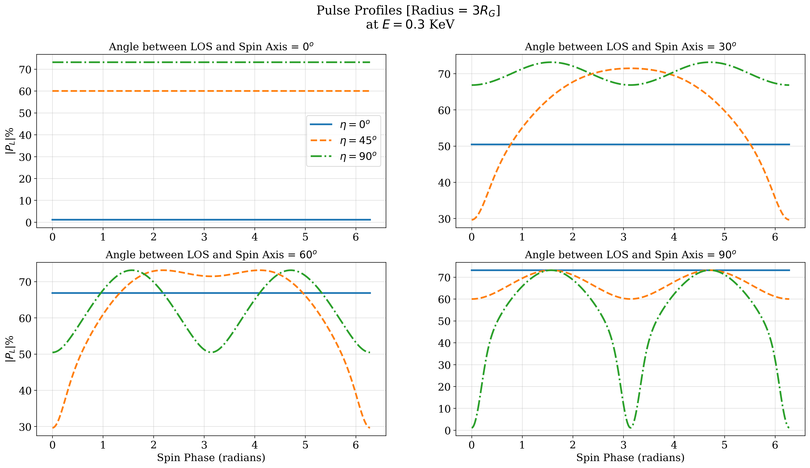
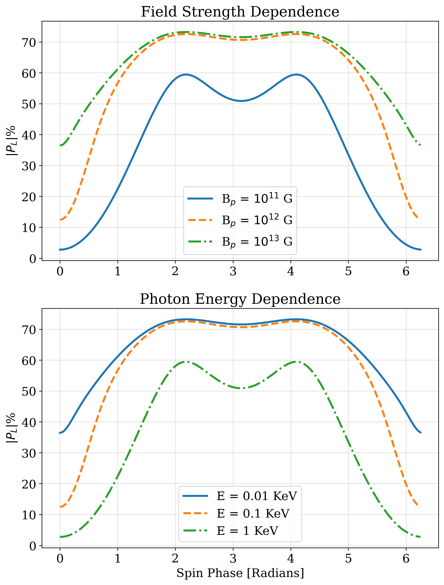

# Introduction
## What are Neutron Stars
Neutron stars are supernova remanants. Densest (~10^17 kg/m^3) known objects in the universe (excluding blackholes) and they produce the strongest known magnetic fields (10^12 - 10^15 G). Like black-holes, they are exotic laboratories for discovering new physics. Unlike blackholes, information of various kind escapes a NS.  
## Why study Neutron Stars
Studying the Mass-Radius relationship gives us constraints on the equation of state governing the Neutron Star. Acquiring an appropriate equation of state is, in some ways, the gold standard of pulsar physics, which subsequently exists on the intersections of many domains (QED, Nuclear Physics, General Relativity, Condensed Matter Physics, etc.)
# Defining the Problem
## Narrowing Parameter Space
We see neutron stars as point objects with some periodic pulsation. Understanding how to simulate pulse profiles can, through bayesian inferences, help us narrow down the configuration of the neutron star. 

## Extracting Surface Details
# Explaining the Solution
## Ray Tracing Approximation
Neutron stars studies exist in regimes where General Relativistic effects become signficant. Light from the 'other' side of a neutron star can bend and contribute towards the total flux observed.  
! 
Fortunately, we understand well how light rays bend in schwarzschild geometries 
! 
Unfortunately, solving the photon propagations equation, for each patch of the neutron star, at each rotation phase, all the way to the observer, is very computationally heavy. This constraints the kinds of explorations which are possible (both at personal computer domains and HPC domains). In our computations, we use beloborov approximation to relate latitude with angle from the normal. To further improve the accuracy, we add an additional correction term. This takes care of the lensing effects.  
! 
## Create a neutron star
Specify attributes like the angle between magnetic pole and rotation axis, rotation axis and line of sight, mass, radius, magnetic field strength, etc. For a wide range of investigations, I created a diverse catalog of differing neutron star objects for quick access. 
## Define an observation
Specify which object you are observing, for how long and in what spectra. This generates the desired pulse profiles of the Q and U stokes parameters along with the intensity. 
On my laptop's six cores, I can perform six parallel observations. In principle, with more computing power, one can perform the surface integration and phase profiles in parallel too.

## Results
Some of the results generated from the developed simulation program are demonstrated here. But I would like to mention that I tried developing the program in a modular and versatile fashion. So, the results can be extended further with relative ease.  
  
  
# On-Going and Future Work
In the next couple of weeks, following are the areas I wish to explore and implement. 
## Calculating Bayes Factor
Initially, by adding increasing amounts of noise to simulated pulse profiles and testing how well I can extract the original object attributes. Bayesian inferences, with the number of parameters we are considering, are extremely computationally intensive. Therefore, I am already looking into translating the existing code and write most of the future code in CUDA (which I can run on my university's HPC).

## Interface with or Introduce Slab Physics
Currently, we assume simple polarization configurations on the surface and then transport these simple maps onto the observer. However, current theories make predictions about the kind of polarization we should be expecting on the surface. These simulations can, depending on the how much of the physics we involve, can get quite involved. I plan to either implement an in-house first order implementation of slab physics or develop method of interfacing with existing neutron star simulation codes. 
### Conclusion
I end with an example of such further interaction that could be explored i.e. vacuum birefringence. This is property of vacuum to let light travel differently based on its polarization (maxwell's equations become non-linear throuh QED calculations). This is also an example of why I enjoy studying astrophysics so much - vacuum birefringence is a  theoretical prediction which was incredibly hard to test because it is very difficult to generate magnetic fields strong enough for it to come into play. But, as has been the case numerous times historically, astrophysical systems (in this case neutron stars/magnetars) provide a natural laboratory to test such prediction.
